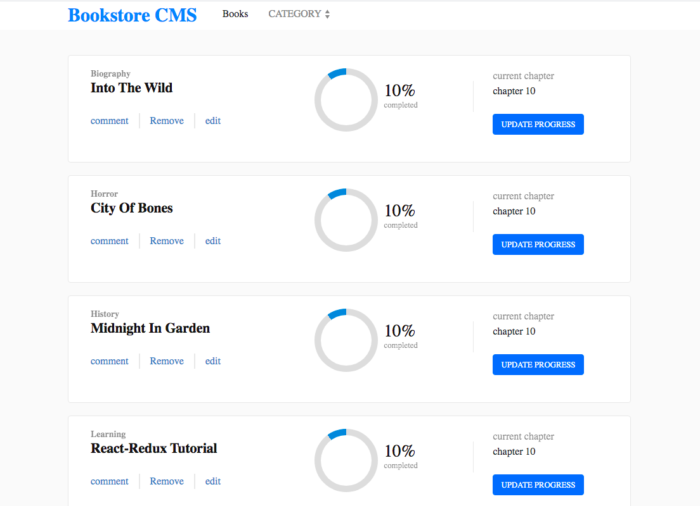

<h1 align=center> **Bookstore with React & Redux ** </h1>

[](https://github.com/RichardLitt/standard-readme)
[](https://david-dm.org/dwyl/esta)

This project comes after the introduction of the React & Redux JS framework. The main aim of the project is to learn how to build a very simple React application using Redux as a state management system. The project has been split into multiple milestones, and each milestone has functional and technical requirements that needs to be implemented.

The project is part of a series of projects to be completed by students of [Microverse](https://www.microverse.org/ "The Global School for Remote Software Developers!").




## Background

- Node.js
- React
- React-DOM
- React-Create-App
- Redux
- react-redux
- npm
- CSS
- ES6

## Demo
The demo page can be found [HERE](https://serene-golick-bd6385.netlify.app/)

## Usage

> Clone the repository to your local machine

```sh
$ git clone https://github.com/macbright/react-book-store.git
```

> cd into the directory

```sh
$ cd book-store
```

> install the npm packages

```sh
$ npm install
```

> use npm or yarn to start the server (note: you must have npm and yarn install)

```sh
$ yarn start
```
OR

```sh
$ npm run start
```
this runs the app in the development mode.<br />
Open [http://localhost:3000](http://localhost:3000) to view it in the browser.

The page will reload if you make edits.<br />
You will also see any lint errors in the console.


## Maintainers 

👤  **Bright Okike**

- Github: [@macbright](https://github.com/macbright)
- LinkedIn: [@bokike](https://www.linkedin.com/in/bokike/)
- Twitter: [@b_okike](https://twitter.com/b_okike)
  

👤  **Shakhawat Hossain**
- Github: [Shakhawat Hossain](https://github.com/shshamim63)
- LinkedIn: [Shakhawat Hossain](https://www.linkedin.com/in/shakhawathossainshamim/)


## Contributing

1. Fork it (https://github.com/macbright/react-book-store.git)
2. Create your feature branch (git checkout -b feature/[choose-a-name])
3. Commit your changes (git commit -am 'What this commit will fix/add')
4. Push to the branch (git push origin feature/[chosen name])
5. Create a new Pull Request

## License

Bright okike & Shakhawat Hossain
[MIT license](https://opensource.org/licenses/MIT).
